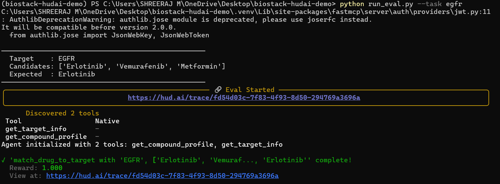
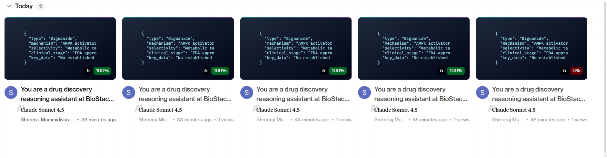

# 🧬 BioStack × hud.ai — Drug-Target Reasoning Agent

> **Reinforcement Learning Environment** for AI agents to match drug compounds to protein targets using structured biomedical data.


## 🎥 Demo Video

**3-minute demo** — See the AI agent reason through drug discovery tasks:

[🎬 Watch Demo Video](./[Biostack%20x%20HudAI]%20Demo%20Usecase.mp4)

*Click to watch → Agent uses tools, reasons biologically, scores 100%*


## 📌 Overview

A toy RL environment on [hud.ai](https://hud.ai) that teaches AI agents to reason through drug-target matching using BioStack's structured data pipelines. Demonstrates how biomedical data can be packaged for AI training.


## 🎯 Problem & Solution

| Challenge | BioStack Approach | Demo Implementation |
|---|---|---|
| Fragmented biological data | Structured ML-ready pipelines | Agent-callable tools for targets/compounds |
| Static datasets don't teach reasoning | Workflow-aligned environments | Multi-step reasoning with tool usage |
| AI labs need training signals | RL environments with rewards | hud.ai traces every decision for training |

## 🏗️ Architecture

```
BioStack Data Pipeline
         ↓
  hud.ai Environment (env.py)
  ├── Tools: get_target_info(), get_compound_profile()
  └── Scenario: match_drug_to_target()
         ↓
  AI Agent (Claude/GPT/Gemini)
  └── Uses tools → reasons → outputs answer
         ↓
  Reward Signal (1.0/0.0)
         ↓
  Training traces → Better domain-specific AI
```


## 🧪 Use Case: Drug-Target Matching

**Scenario**: Agent receives a protein target and 3 drug candidates, must identify the best therapeutic match.

**Example Task**:
```json
{
  "target": "EGFR",
  "candidates": ["Erlotinib", "Vemurafenib", "Metformin"],
  "correct": "Erlotinib"
}
```

**Agent Process**:
1. Calls `get_target_info("EGFR")` → learns it's a tyrosine kinase in lung cancer
2. Calls `get_compound_profile()` for each candidate
3. Reasons: *"EGFR needs EGFR inhibitor → Erlotinib"*
4. Outputs: `Erlotinib` ✅ → **Reward: 1.0**

[🔗 View Agent Reasoning Trace](https://www.hud.ai/trace/fb72f723-c354-4098-8ae5-a0172b309f27)


## 📁 Project Structure

```
biostack-hudai-demo/
├── env.py          ← Environment: tools + scenarios
├── tasks.json      ← Evaluation task dataset
├── run_eval.py     ← Python runner for testing
├── hud.toml        ← hud.ai project config
└── README.md       ← This file
```

## 💻 Key Components

### Environment (`env.py`)
- **Tools**: `get_target_info()`, `get_compound_profile()`
- **Scenario**: `match_drug_to_target()` with reward logic
- **Data**: Structured protein targets and drug compounds

### Evaluation (`tasks.json`)
- Drug-target matching tasks
- Covers EGFR, BRAF, VEGFR2 targets
- Multiple candidate combinations

### Runner (`run_eval.py`)
- Local testing with quick tasks
- Batch evaluation of all tasks
- Real-time reward scoring

## 🚀 Quick Start

### Prerequisites
- Python 3.11+
- [hud.ai](https://hud.ai) account + API key

### Setup

```bash
# 1. Install hud CLI
pip install hud-python

# 2. Set API key
export HUD_API_KEY=your-key-here

# 3. Login
hud login
```

### Run Evaluation

```bash
# Activate virtual environment
.venv\Scripts\activate

# Run single task
python run_eval.py --task egfr

# Run all tasks
python run_eval.py --all
```

## 📊 Expected Results

```
──────────────────────────────────────────────────
  Target    : EGFR
  Candidates: ['Erlotinib', 'Vemurafenib', 'Metformin']
  Expected  : Erlotinib
──────────────────────────────────────────────────
  Agent answer : Erlotinib
  Reward       : 1.0
  Status       : PASS ✅
──────────────────────────────────────────────────

Score: 3/3 (100%)
```



## 🔧 Internal Working

### Reward Logic
```python
# Lenient matching - agent can include extra text
reward = 1.0 if correct in answer else 0.0
```

### Agent Answer Extraction
```python
def get_answer(result) -> str:
    """Extract agent's answer from Trace object"""
    for attr in ("response", "answer", "output", "final_response"):
        val = getattr(result, attr, None)
        if val:
            return str(val).strip()
    # Fallback to last message content
    messages = getattr(result, "messages", None)
    if messages:
        return str(messages[-1].content).strip()
    return "N/A"
```

### Tool Integration
- Tools provide structured biomedical data
- Agent must call tools to get information
- No hardcoded knowledge in prompts

## 📈 hud.ai Dashboard

Every run is traced at [hud.ai/home](https://hud.ai/home):
- Tool calls and reasoning chain
- Reward scores per task
- Training-ready trace data
- Performance analytics




*Built as a proof-of-concept for BioStack's AI environment strategy*  
*Date: May 2026*
